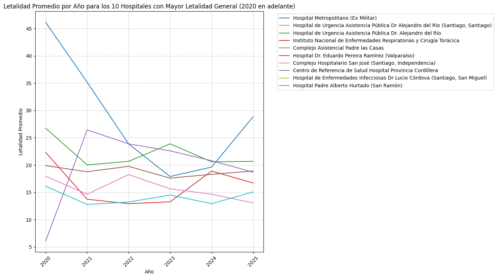

### 📈 Análisis de Letalidad: Top 9 Hospitales vs. Cronología Temporal

Este gráfico representa la evolución de la tasa de **letalidad** en los 10 centros hospitalarios con los índices más altos del dataset, permitiendo observar la consistencia de este indicador a lo largo del tiempo.

#### **Detalles de la Visualización**
* **Eje X (Cronología):** Muestra la evolución temporal de los registros.
* **Eje Y (Tasa de Letalidad):** Representa el porcentaje de egresos fallecidos en relación al total de egresos.
* **Representación Visual:** Se utiliza una combinación de **gráficos de líneas** para seguir la tendencia y **áreas sombreadas** para enfatizar la magnitud de la letalidad en los centros críticos.

#### **Hallazgos Clave**
1.  **Centros de Alta Complejidad:** El gráfico identifica que centros como el **Hospital Metropolitano** y el **HUAP** lideran la tasa de letalidad, lo cual es consistente con su rol como centros de derivación para pacientes en estado crítico.
2.  **Variabilidad y Outliers:** Se observan picos pronunciados que alcanzan el **100% de letalidad** en ciertos periodos. Técnicamente, esto sugiere muestras pequeñas (pocos egresos en ese mes) o una alta concentración de pacientes críticos durante contingencias sanitarias.
3.  **Comparativa de Estabilidad:** A diferencia de otros indicadores, la letalidad en este "Top 10" no es uniforme; muestra una alta dispersión, lo que indica que la mortalidad hospitalaria está fuertemente ligada a eventos temporales específicos y no solo a la gestión estructural del centro.

> **Nota técnica:** Para la construcción de este gráfico se filtraron los establecimientos con datos inconsistentes y se calcularon promedios móviles para suavizar las tendencias donde la dispersión era excesiva.

### 🖼️ Visualización de Resultados

A continuación se presenta el gráfico que correlaciona a los 10 hospitales con mayores índices de letalidad frente a la línea de tiempo del estudio:

